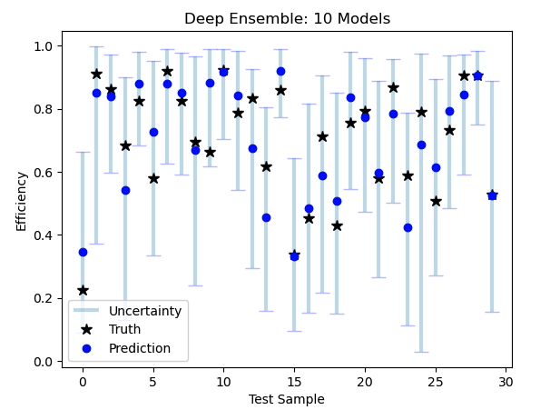

# Uncertainty Quantification with Deep Regression Ensembles, including a PyTorch implementation of the CRISPRon architecture. 

This notebook provides and implementation of Deep Ensembles (Lakshminarayanan et al., 2017) for the case of univariate regression, encompassing the case for Normal, Beta, and Gamma response variables for `(-Inf, Inf)`, `(0,1)`, and `(0, Inf)` data, respectively. The reported uncertainty are quantiles of the predictive distribution from the equally weighted ensemble. The latter is estimated numerically via simulating `n_samples` from the predictive distribution of each ensemble member (model), and then reporting the empirical quantiles of the pooled samples. 

Included is a PyTorch implementation of the CRISPRon architecture for guideRNA design, as described in *Xiang, Xi, et al. "Enhancing CRISPR-Cas9 gRNA efficiency prediction 
by data integration and deep learning." Nature communications 12.1 (2021): 3238.*, which is a multimodal neural net architecture that takes as input a sequence and a static feature vector. 

Accompanying the model is a custom `DataSet` class for the case where a single model input is `(sequence, features)`, where `sequence` is a vector-valued sequence, and `features` is a vector of features, as is the case for CRISPRon.  

Just running the cells that define the custom classes, and then use is reasonably simple. 

```python
myData = Seqs_and_Features(train_S, train_F, train_y)

myEnsemble = RegressionDeepEnsemble(BaseNet=CRISPRnet, dataset=myData,
                                    n_estimators=10, batch_size=100,
                                    response_var = torch.distributions.Beta)

myEnsemble.train_ensemble(n_epochs=20)
myEnsemble.predict(inputs = (test_S, test_F))
```
There is also a built in tool for visualisation of uncertainties: 

```python
myEnsemble.plot_uncertainties(inputs=(S_test, F_test), 
                              true_vals = y_test, plot_means=False,
                              lower=0.01, upper=0.99, n_samples=500)
```


